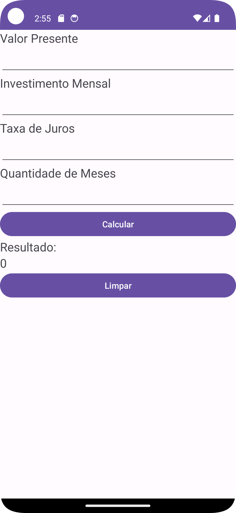

# Calculadora de investimento

Este projeto Android é uma calculadora financeira que visa calcular o valor futuro de um investimento com base em alguns parâmetros, como o valor presente, o investimento mensal, a taxa de juros e o prazo de aplicação. Aqui está um resumo do que foi feito no projeto:

1. **Layout da Interface Gráfica:**
   - A interface gráfica foi definida no arquivo XML `activity_main.xml`.
   - Utiliza `EditText` para entrada de dados (valor presente, investimento mensal, taxa de juros e prazo de aplicação).
   - Botões para calcular e limpar, e um `TextView` para exibir o resultado.

2. **Classe `MainActivity`:**
   - Herda de `AppCompatActivity` e implementa a lógica principal do aplicativo.
   - Define variáveis para os componentes da interface, como `EditText`, `Button` e `TextView`.
   - No método `onCreate`, os componentes são inicializados e os listeners para os botões são configurados.

3. **Método `calcularValorFuturo()`:**
   - É chamado quando o botão de calcular é pressionado.
   - Obtém os valores dos campos de entrada.
   - Verifica se algum campo está vazio e exibe uma mensagem caso esteja.
   - Tenta converter os valores para tipos numéricos e realiza os cálculos financeiros usando o método `calcularValorFuturo(double, double, double, int)`.
   - Exibe o resultado no `TextView` da interface.

4. **Método `calcularValorFuturo(double, double, double, int)`:**
   - Realiza os cálculos financeiros para determinar o valor futuro do investimento.
   - Converte a taxa de juros de porcentagem para decimal.
   - Utiliza um loop para simular o investimento ao longo do prazo de aplicação, aplicando a fórmula de juros compostos.

5. **Método `limparCampos()`:**
   - É chamado quando o botão de limpar é pressionado.
   - Limpa todos os campos de entrada e o campo de resultado.

O aplicativo segue a lógica financeira de calcular o valor futuro de um investimento com base nos princípios de juros compostos, permitindo que o usuário insira diferentes parâmetros para obter o resultado desejado.

## Imagem do app 

## Agradecimento

Caro [Prof. Cid](linkedin.com/in/cidrandrade),

Agradeço pela oportunidade de desenvolver o projeto de calculadora financeira em Android. Foi uma experiência enriquecedora que contribuiu para o meu aprendizado. 🚀 Obrigado pela orientação.

Grato,
Minoru 🙏